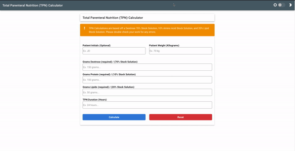

# vue-tpn-calculator

As a Registered Dietitian Nutritionist (RDN), I have calculated numerous total parenteral nutritions throughout my entire career. Ensuring the safety in accurate calculation of macronutrients dextrose, protein, and lipids, this calculator aims to provide RDN's the comfort of calculating their patient's TPN over a specified period of time.

This project utilizes Vue.js, Vuetify, VueFormulate, and Vue-ApexChart.



## Project setup
```
yarn install
```

### Compiles and hot-reloads for development
```
yarn serve
```

### Compiles and minifies for production
```
yarn build
```

### Run your unit tests
```
yarn test:unit
```

### Lints and fixes files
```
yarn lint
```

### Customize configuration
See [Configuration Reference](https://cli.vuejs.org/config/).
